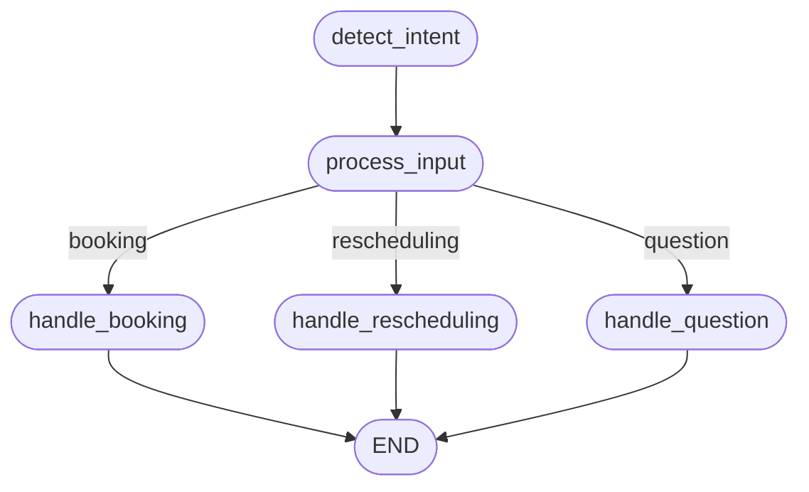

# Hotel Booking Agent (LangGraph & LLMs)

## Overview
This project is an AI-powered hotel booking agent built with LangGraph, LangChain, and Groq LLM. It can:
- Book hotel rooms (collecting check-in/check-out dates, room type, number of guests)
- Reschedule existing reservations
- Answer hotel-related questions (amenities, check-in times, etc.)
- Maintain conversation history for context-aware responses
- (Demo) Interact with users via Instagram DMs (mocked for local testing)

---

## Features
- **Conversational AI**: Guides users through booking, rescheduling, and Q&A.
- **Stateful**: Maintains context and conversation history using LangGraph.
- **Lightweight Storage**: Uses a JSON file for reservation data.
- **Instagram Integration**: Mocked for demo; prints responses instead of sending real DMs.
- **Robust Error Handling**: Handles invalid input, API errors, and file errors.

---

## Setup Instructions

### 1. Clone the Repository
```
git clone <your-fork-url>
cd Hiring_challange
```

### 2. Install Dependencies
```
pip install -r requirements.txt
```
(If `requirements.txt` is missing, install: `langchain-groq`, `langgraph`, `langchain-core`, `python-dotenv`, `requests`, `pydantic`)

### 3. Set Up Environment Variables
Create a `.env` file in the project root:
```
GROQ_API_KEY=your_actual_groq_api_key_here
```

### 4. Run the Agent
```
python hotel_booking_agent.py
```
You will see the agent's responses printed to the console (mock Instagram DMs).

---

## Architecture & Design Choices
- **LangGraph State Machine**: Manages the flow between intent detection, input processing, booking, rescheduling, and Q&A.
- **TypedDict State**: Ensures type safety and compatibility with LangGraph.
- **LLM (Groq)**: Handles intent classification and Q&A. Model: `llama3-70b-8192` (free tier, fast, and reliable).
- **JSON Storage**: Simple, portable, and easy to inspect for demo/testing.
- **Instagram API Mock**: For demo, the `send_instagram_message` function prints to console. Swap in real API logic for production.
- **Error Handling**: All user input and API calls are wrapped with error handling for robustness.

---

## LangGraph Flow Diagram



---

## Example Usage
```
I want to book a room
2025-07-01
2025-07-03
deluxe
2
What are the hotel amenities?
```

---

## Submission Checklist
- [x] Booking, rescheduling, and Q&A flows
- [x] LangGraph state machine
- [x] Code quality and error handling
- [x] Documentation and flow diagram

---

## Notes
- For real Instagram integration, implement the `send_instagram_message` function with the Instagram Graph API and provide a valid access token.
- For any questions, contact: founders@powersmy.biz
